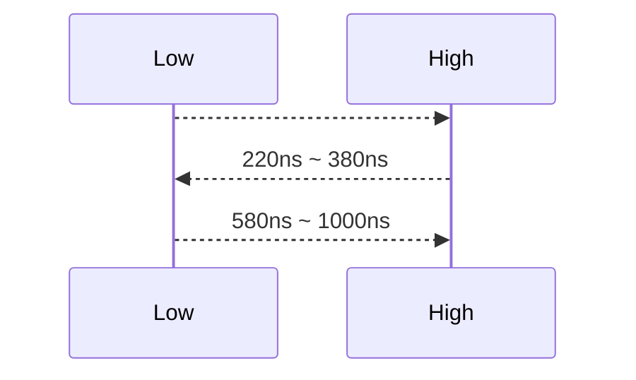
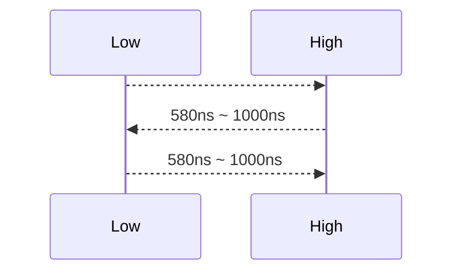

## Links

### Pico

Raspberry Pi Pico Home
https://www.raspberrypi.com/products/raspberry-pi-pico-2/
https://www.raspberrypi.com/products/raspberry-pi-pico

Raspberry Pi Pico をセットアップしよう
https://datasheets.raspberrypi.com/pico/getting-started-with-pico-JP.pdf

RP2040 を使用したハードウェア設計
https://datasheets.raspberrypi.com/rp2040/hardware-design-with-rp2040-JP.pdf

#### MicroPython

GetStart MicroPython
https://www.raspberrypi.com/documentation/microcontrollers/micropython.html

python-sdk
https://datasheets.raspberrypi.com/pico/raspberry-pi-pico-python-sdk.pdf

MicroPython
https://micropython.org/

### ピンアサイン

Pico, Pico2
https://datasheets.raspberrypi.com/pico/Pico-2-Pinout.pdf

| No  | GPNo | Func1    | Func2    | Func3    |
| :-: | :--- | :------- | :------- | :------- |
|  1  | GP0  | UART0 TX | I2C0 SDA | SPI0 RX  |
|  2  | GP1  | UART0 RX | I2C0 SCL | SPI0 CSn |
|  3  | GND  |          |          |          |
|  4  | GP2  |          | I2C1 SDA | SPI0 SCK |
|  5  | GP3  |          | I2C1 SCL | SPI0 TX  |
|  6  | GP4  | UART1 TX | I2C0 SDA | SPI0 RX  |
|  7  | GP5  | UART1 RX | I2C0 SCL | SPI0 CSn |
|  8  | GND  |          |          |          |
|  9  | GP6  |          | I2C1 SDA | SPI0 SCK |
| 10  | GP7  |          | I2C1 SCL | SPI0 TX  |
| --- | ---- | -------- | -------- | -------- |
| 11  | GP8  | UART1 TX | I2C0 SDA | SPI1 RX  |
| 12  | GP9  | UART1 RX | I2C0 SCL | SPI1 CSn |
| 13  | GND  |          |          |          |
| 14  | GP10 |          | I2C1 SDA | SPI1 SCK |
| 15  | GP11 |          | I2C1 SCL | SPI1 TX  |
| 16  | GP12 | UART0 TX | I2C0 SDA | SPI1 RX  |
| 17  | GP13 | UART0 RX | I2C0 SCL | SPI1 Csn |
| 18  | GND  |          |          |          |
| 19  | GP14 |          | I2C1 SDA | SPI1 SCK |
| 20  | GP15 |          | I2C1 SCL | SPI1 TX  |

| No  | GPNo       | Func1    | Func2    | Func3    |
| :-: | :--------- | :------- | :------- | :------- |
| 21  | GP16       | UART0 RX | I2C0 SDA | SPI0 RX  |
| 22  | GP17       | UART0 TX | I2C0 SCL | SPI0 CSn |
| 23  | GND        |          |          |          |
| 24  | GP18       |          | I2C1 SDA | SPI0 SCK |
| 25  | GP19       |          | I2C1 SCL | SPI0 TX  |
| 26  | GP20       |          | I2C0 SDA |          |
| 27  | GP21       |          | I2C0 SCL |          |
| 28  | GND        |          |          |          |
| 29  | GP22       |          |          |          |
| 30  | RUN        |          |          |          |
| --- | ---------- | -------- | -------- | -------- |
| 31  | GP26       |          | I2C1 SDA | ADC0     |
| 32  | GP27       |          | I2C1 SCL | ADC1     |
| 33  | GND        |          |          | AGND     |
| 34  | GP28       |          |          | ADC2     |
| 35  |            |          |          | ADC VREF |
| 36  | 3V3<br>OUT |          |          |          |
| 37  | 3V3<br>EN  |          |          |          |
| 38  | GND        |          |          |          |
| 39  | VSYS       |          |          |          |
| 40  | VBUS       |          |          |          |

## PIO

https://karakuri-musha.com/inside-technology/arduino-raspberrypi-picow-tips-piostartup01/

- [Interface 2021 年 8 月号](https://interface.cqpub.co.jp/magazine/202108/)
- [ラズピコ PIO ～解説編～](https://moons.link/pico/post-498/)
- [Raspberry Pi Pico のProgrammable I/O (PIO)入門](https://qiita.com/fude-t/items/d2baf1c98ba807273dcf)
- [初めの一歩！ラズパイ Pico マイコン ×Python で L チカ入門](https://www.zep.co.jp/utaguchi/article/z-picoled_all-da1/)
- [Raspberry Pi Pico/W のPIOを調査するぞ！（PIO : Programmable I/O）](https://karakuri-musha.com/inside-technology/arduino-raspberrypi-picow-tips-piostartup01/)

### MicroPython プログラム

```python:最小限のプログラム
from machine import Pin
import rp2
import time

@rp2.asm_pio(set_init=rp2.PIO.OUT_LOW)
def blink_led():
  set(pins, 1)
  set(pins, 0)

led_pin = Pin("LED", Pin.OUT)
sm = rp2.StateMachine(0, blink_led, set_base=led_pin, freq=2000)

sm.active(1)
time.sleep(5)
sm.active(0)
```

- `@rp2.asm_pio`
  処理を記述する関数に付けるデコレータで、初期値などをセットするのに使用する。
  [PIO 関連関数](https://micropython-docs-ja.readthedocs.io/ja/latest/library/rp2.html)

  - GPIO ピンの初期状態を指定(PIO.IN_LOW | PIO.IN_HIGH | PIO.OUT_LOW | PIO.OUT_HIGH)
    複数のピンを指定する場合はタプルで指定する ex) out_init=(PIO.OUT_LOW, PIO.OUT_LOW)
    ピンの先頭は `rp2.StateMachine` で指定する
    - out_init=None
    - set_init=None
    - sideset_init=None
      - side_pindir=False ※ True を指定するとピンの方向を指定することに注意

  - シフトする方向を指定(PIO.SHIFT_LEFT | PIO.SHIFT_RIGHT)
    PIO.SHIFT_RIGHT = MSB -> LSB の方向にシフト = MSB から1ビットずつ
    PIO.SHIFT_LEFT  = MSB <- LSB の方向にシフト = LSB から1ビットずつ
    - in_shiftdir=PIO.SHIFT_LEFT
    - out_shiftdir=PIO.SHIFT_LEFT

  - auto 発動のしきい値（ビット数）
    - push_thresh=32
    - pull_thresh=32

  - 機能の有効化
    - autopush=False
    - autopull=False

  - 8 つの FIFO の TX と RX への割り当て(PIO.JOIN_NONE(TX=4, RX=4) | PIO.JOIN_TX(TX=8, RX=0) | PIO.JOIN_RX(TX=0, RX=8))
    - fifo_join=PIO.JOIN_NONE

- `def xxx():`
  処理の内容をアセンブリ言語で記述する

  - 基本命令
    - jmp() : ラベルにジャンプする
    - wait(): 指定したピンが指定した値(high | low)になるまで待つ
    - in_() : ISR(シフトレジスタ) に値をシフトする
    - out() : OSR(シフトレジスタ) から値をシフトする
    - push(): ISR(シフトレジスタ) からRX FIFO にデータをプッシュ
    - pull(): TX FIFO から OSR(シフトレジスタ) にデータをプル
    - mov() : 値を移動する
    - irq() : IRQ フラグをセット
    - set() : 値を指定した場所にセット
  - 修飾子
    - .side()
    - .delay()
    - [value] = .delay(value)
  - その他
    - nop()
    - warp_target(): プログラムの折り返し後に実行を継続する位置を指定
    - wrap()       : プログラムの終端と折り返しの位置を指定
    - label()      : jmp() 用のラベルをつける
    - word()

- `sm = rp2.StateMachine`
  ステートマシンをインスタンス化する。
  PIO 1 つにつき、ステートマシンが 4 個入っており、PIO は 2個ある。計 8 個のステートマシンが存在。0～7 で指定。
  [PIOインタフェース](https://micropython-docs-ja.readthedocs.io/ja/latest/library/rp2.StateMachine.html)

  - id:
    -  0～3: PIO1個目
    -  4～7: PIO2個目
 - program: 処理内容を記述したメソッドを指定
 - freq=-1: 実行周波数(Hz) デフォルトは125MHz
 - 使用する先頭ピンの指定
   - in_base=None : in() で使用
   - out_base=None: out() で使用
   - set_base=None: set() で使用
   - jmp_pin=None : jmp() で使用
   - sideset_base=None: sideset で使用
 - シフトする方向を指定(PIO.SHIFT_LEFT | PIO.SHIFT_RIGHT)
   - in_shiftdir=None : @rp2.asm_pio と同じ。上書きできる。
   - out_shiftdir=None: @rp2.asm_pio と同じ。上書きできる。
 - auto 発動のしきい値（ビット数）
   - push_thresh=None : @rp2.asm_pio と同じ。上書きできる。
   - pull_thresh=None : @rp2.asm_pio と同じ。上書きできる。auto 発動のしきい値（ビット数）


- `sm.active(1)`
  ステートマシンの実行開始

#### [サンプル](https://github.com/raspberrypi/pico-micropython-examples/blob/master/pio)

```python:blink.py
from machine import Pin
import rp2
import time

# LED をチカチカさせるプログラム

# set 命令に１つの GPIO が割り当てられていて、出力ピンとなっている。
# たくさんのディレイを使って、人間の目に点滅が見えるようにしている。
# set命令含めて 32 * 5 = 160 サイクルなので、160(times) * 0.5m(sec/times) = 80m(sec)
@rp2.asm_pio(set_init=rp2.PIO.OUT_LOW)  # 初期値は LOW
def blink():
    wrap_target()       # プログラムの折り返し位置
    set(pins, 1)   [31] # set_baseで割り当てているピンをHIGHにして、31サイクルディレイする
    nop()          [31] # 何もしない命令 1サイクル + 31 ディレイ = 32サイクルディレイ
    nop()          [31]
    nop()          [31]
    nop()          [31]
    set(pins, 0)   [31] # set_baseで割り当てているピンをLOWにして、31サイクルディレイする
    nop()          [31]
    nop()          [31]
    nop()          [31]
    nop()          [31]
    wrap()              # ここでプログラムを折り返す

# ステートマシンをインスタンス化
# blink() プログラムを、2000Hzで実行。set関数用にLEDピンを指定している。
# 2000Hz = 1(sec) / 2000(times) = 0.5m sec/times = 1サイクルの時間
sm = rp2.StateMachine(0, blink, freq=2000, set_base=Pin(25))

# 3秒間ステートマシンを実行する
sm.active(1)
time.sleep(3)
sm.active(0)
```

```python:1hz.py
from machine import Pin
import rp2
import time

# LED をチカチカさせるプログラム

@rp2.asm_pio(set_init=rp2.PIO.OUT_LOW)
def blink_1hz():
  # cycles = 1 + 1 + (1+5) + (30+1)*32 = 1000
  # LED ピンを HIGH にして、1000サイクル = 0.5sec
  irq(rel(0))                   # 1
  set(pins, 1)                  # 1
  set(x, 31)               [5]  # 6
  label("delay_high")
  nop()                    [29] # 30
  jmp(x_dec, "delay_high")      # 1  x が 0 になるまでジャンプ（32回繰り返す）

  # cycles = 1 + (1+6) + (30+1)*32 = 1000
  # LED ピンを LOW にして、1000サイクル = 0.5sec
  set(pins, 0)                  # 1
  set(x, 31)               [6]  # 7
  label("delay_high")
  nop()                    [29] # 30
  jmp(x_dec, "delay_high")      # 1  x が 0 になるまでジャンプ（32回繰り返す）

sm = rp2.StateMachine(0, blink_1hz, freq=2000, set_base=Pin("LED", Pin.OUT))
sm.irq(lambda p: print(time.ticks_ms()))
sm.active(1)
```

```python:exec.py
from machine import Pin
import rp2
import time

# StateMachine.exec() を使った命令の実行

@rp2.asm_pio(set_init=rp2.PIO.OUT_LOW)
def prog():
  pass

sm = rp2.StateMachine(0, prog, set_base=Pin("LED"))

sm.exec("set(pins, 1)")
time.sleep(0.5)
sm.exec("set(pins, 0)")

set_H = rp2.asm_pio_encode("set(pins, 1)", 0)
set_L = rp2.asm_pio_encode("set(pins, 0)", 0)
sm.exec(set_H)
time.sleep(0.5)
sm.exec(set_L)
```

```python:irq.py
import time
import rp2

# irq のサンプル
# ひとつの PIO は 0～7 の割り込みフラグがあり、各ステートマシンで共有している。
# 0～3: システムレベル割込
# 4～7: ステートマシン内割込

@rp2.asm_pio()
def irq_test():
  wrap_target()
  nop()   [31]  # 32*4 = 128 サイクル
  nop()   [31]
  nop()   [31]
  nop()   [31]
  irq(0)
  nop()   [31]  # 32*4 = 128 サイクル
  nop()   [31]
  nop()   [31]
  nop()   [31]
  irq(1)
  wrap()

rp2.PIO(0).irq(lambda pio: print(pio.irq().flags()))

sm = rp2.StateMachine(0, irq_test, freq=2000)
sm.active(1)
time.sleep(1)
sm.active(0)
```

```python:pinchange.py
from machine import Pin
import rp2
import time

# ピンの状態が LOW になるまでウェイトし、割り込みを発生する

@rp2.asm_pio()
def wait_pin_low():
  wrap_target()
  wait(0, pin, 0)     # in_base で指定されたピンが LOW になるまで待つ
  irq(block, rel(0))  # 割り込みフラグをセット。相対的なインデックス指定
  wait(1, pin, 0)     # in_base で指定されたピンが HIGH になるまで待つ
  wrap()

def handler(sm):
  print(time.ticks_ms(), sm)

pin16 = Pin(16, Pin.IN, Pin.PULL_UP)
sm0 = rp2.StateMachine(0, wait_pin_low, in_base=pin16)
sm0.irq(handler)

pin17 = Pin(17, Pin.IN, Pin.PULL_UP)
sm1 = rp2.StateMachine(1, wait_pin_low, in_base=pin17)
sm0.irq(handler)

sm0.active(1)
sm1.active(1)
```

#### NeoPixel(WS2812)

- ピン
  - 3.3V
  - GND
  - Data

- データ
  - 1bit
    - 0: T0H(0.4us $\pm$150ns) + T0L(0.85us $\pm$150ns) = 1.25us $\pm$600ns
    - 1: T1H(0.8us $\pm$150ns) + T1L(0.45us $\pm$150ns) = 1.25us $\pm$600ns
    - リセット: 50us以上のLow
  - 色(24bit)
    -  0～7 : G
    -  8～15: R
    - 16～23: B

- value0



- value1



- 時間
  - 新しいバージョン
    - T1: 300ns(0 のHighの時間)
    - T2: 700ns(1 のHighの時間)
    - T3: 700ns(0,1 共通のLowの時間)

  - 古いバージョン
    - T1: 0.25ns(0,1 共通のHighの時間)
    - T2: 0.625ns(0 はLow, 1 は High)
    - T3: 0.375ns(0,1 共通のLowの時間)
      - 0 => High=T1,    Low=T2+T3
      - 1 => High=T1+T2, Low=T3

```python:ws2812.py
import array, time
from machine import Pin
import rp2

# WS2812 LED の個数
NUM_LEDS = 8

# 24ビット毎に自動でMSBから出力していく
@rp2.asm_pio(sideset_init=rp2.PIO.OUT_LOW, out_shiftdir=rp2.PIO.SHIFT_LEFT, autopull=True, pull_thresh=24)
def ws2812():
  # 1bit の処理を記述
  T1 = 2
  T2 = 5
  T3 = 3
  wrap_target()
  label("bitloop")
  out(x, 1)               .side(0)    [T3 - 1]  # T3=3サイクル待つ
  jmp(not_x, "do_zero")   .side(1)    [T1 - 1]  # T1=2サイクル待つ
  jmp("bitloop")          .side(1)    [T2 - 1]  # T2=5サイクル待つ
  label("do_zero")
  nop()                   .side(0)    [T2 - 1]  # T2=5サイクル待つ
  wrap()

# PIOを使用しない場合は、machine.bitstrem() が使用できる
# https://micropython-docs-ja.readthedocs.io/ja/latest/library/machine.html#machine.bitstream
# timing = (400, 850, 800, 450) # high_time0, low_time0, high_time1, low_time1 の各ナノ秒
# machine.bitstream(Pin(22), 0, timing, buf)


# Pin(22) に出力
# 周波数 8MHz = 0.125nsec
sm = rp2.StateMachine(0, ws2812, freq=8_000_000, sideset_base=Pin(22))
sm.active(1)

# LED RGB値の配列を使ってLEDのパターンを表示
ar = array.array("I", [0 for _ in range(NUM_LEDS)])

# 色を繰り返す
for i in range(4 * NUM_LEDS):
  for j in range(NUM_LEDS):
    r = j * 100 // (NUM_LEDS - 1)
    b = 100 - j * 100 // (NUM_LEDS - 1)
    if j != i % NUM_LEDS:
      r >>= 3
      b >>= 3
    ar[j] = r << 16 | b

  # 1ワードは32ビットのため、32ビットのデータを扱うが、@rp2.asm_pio で自動プルが指定されていて、
  # 24ビット処理したら自動的にデータを TX FIFO から取り出している。(autopull=True, pull_thresh=24)
  # また、上位ビットからデータを取り出すので、上位 8 ビットが空いてしまう(out_shiftdir=rp2.PIO.SHIFT_LEFT)
  # そこで、put() で TX FIFO にプッシュ時にデータを 8 ビットシフトしておく。
  # xxxxxxxx 11111111 111111111 11111111 => 11111111 111111111 11111111 00000000
  sm.put(ar, 8)
  time.sleep_ms(50)

# フェードアウト
for i in range(24):
  for j in range(NUM_LEDS):
    ar[j] >>= 1
  sm.put(ar, 8)
  time.sleep_ms(50)
```

#### UART

- [PIOで自作UART通信](https://note.com/fjtech/n/n15e9a624df08)
- [よく分かる！ シリアル通信基礎講座](https://emb.macnica.co.jp/articles/8191)
- [pio_uart_tx.py](https://github.com/micropython/micropython/blob/master/examples/rp2/pio_uart_tx.py)
- [pio_uart_rx.py](https://github.com/micropython/micropython/blob/master/examples/rp2/pio_uart_rx.py)
- [interface 2024/03](https://www.cqpub.co.jp/interface/download/2024/3/IF2403T2B1S.zip)

- ポイント
  - 通常時（何もデータを送らない idle のとき）は、HIGH の状態になっている = idle high
  - スタートビット(1bit) = 0 を 1bit 送信が開始の合図
  - ストップビット(1|2 bit) = 1 を 1|2 bit 送信が終了の合図
    - 1 or 2 は最初の設定次第
  - データビット(7|8bit)
    - 7 or 8 は最初の設定次第
    - スタートビット後は、baudrate のタイミングで、LSB から 1bit ずつ送信する
  - baudrate は 1 秒間に送るビット数
    - PIO では、1bit の処理を 8サイクルにするために、周波数は `baudrate * データビット数` にする
  - データの読み込みタイミング
    - 1ビットを 8サイクルにしているため、読み込みは真ん中の 4サイクル目のタイミングの値を読み込む
    - このためデータ読み込み時のウェイトは 8+4=12 サイクルとなる

  - パリティ
    - セットする場合は、データの後に置く
    - 偶数パリティ: データビットに含まれる 1 の数の合計が、パリティビットを足して偶数になるようにする
      - ex) data: 1001 0010 => parity: 1, data: 1001 0110 => parity: 0
    - 奇数パリティ: データビットに含まれる 1 の数の合計が、パリティビットを足して奇数になるようにする
      - ex) data: 1001 0010 => parity: 0, data: 1001 0110 => parity: 1
    - パリティなし


```python:uart_tx.py
from machine import Pin, UART
from rp2 import PIO, StateMachine, asm_pio
import utime, time

UART_BAUDRATE = 9600
UART_DATABIT  = 8
CYCLE_PER_BIT = 8
PIO_TX_PIN = Pin(3, Pin.OUT)

# ・sideset, out ピンは出力ピンなので、通常時は HIGH なので初期状態も HIGH にする
# ・LSB からデータを送信するので、右からシフトする
# ・out() で OSR から 8bit シフトしたら自動的に TX FIFO から読み出す
@asm_pio(sideset_init=PIO.OUT_HIGH, out_init=PIO.OUT_HIGH, out_shiftdir=PIO.SHIFT_RIGHT, fifo_join=PIO.JOIN_TX)
def uart_tx():
  CYCLE_PER_BIT = 8

  # 1サイクル ##################################################
  # TX FIFO から OSR にプル
  # ループ前の nop() を含めて 8サイクルになる。
  pull()
  #############################################################

  # 8サイクル ##################################################
  # スタートビット(1bit の side(0)=Low)
  # set の 7 はデータビットの 8ビット分をループするための値
  set(x, 7)     .side(0)  [CYCLE_PER_BIT-1] # 1 + 7 = 8サイクル
  #############################################################
  label("bitloop")
  # 8サイクル ##################################################
  # データビット(LSBから１ビットずつ７ビット分)
  # 7 + 1 = 8サイクルでループ
  out(pins, 1)
  jmp(x_dec, "bitloop")   [CYCLE_PER_BIT-2] # 1 + 6 = 7サイクル
  #############################################################

  # 7サイクル ##################################################
  # ストップビット(1bit の High=side(1))
  # ループして pull() を含めて 8サイクルになる。
  nop()         .side(1)  [CYCLE_PER_BIT-2] # 1 + 6 = 7サイクル。
  #############################################################

# PIO 処理開始
sm = StateMachine(0, uart_tx, freq=UART_BAUDRATE*CYCLE_PER_BIT, sideset_base=PIO_TX_PIN, out_base=PIO_TX_PIN)
sm.active(1)

uart0 = UART(0, baudrate=9600, tx=Pin(0), rx=Pin(1))

# データ送信
for c in "hello world!\n":
  sm.put(ord(c))
  utime.sleep(0.1)

# UART 受信処理
recv = b""
start = time.ticks_ms()
while time.ticks_diff(time.ticks_ms(), start) < 3000:   # 3秒間だけループ
  if uart0.any():
    recv += uart0.read(1)

print("UART0 Received:", recv.decode())
```

```python:uart_rx.py
from machine import Pin, UART
from rp2 import PIO, StateMachine, asm_pio
import utime, time

UART_BAUDRATE = 9600
UART_DATABIT  = 8
CYCLE_PER_BIT = 8
PIO_RX_PIN = Pin(4, Pin.IN, Pin.PULL_UP)

@asm_pio(in_shiftdir=PIO.SHIFT_RIGHT, fifo_join=PIO.JOIN_RX, autopush=True, push_thresh=UART_DATABIT)
def uart_rx():
  # ストップビットを待つ
  # wait(1, pin, 0)

  # 12サイクル ####################################################
  # スタートビット8bit + 4bit(データの真ん中のタイミングを読み込むため)

  # スタートビットを待つ
  wait(0, pin, 0)                 # 1サイクル
  # ループカウンタをセットして、最初のデータビットまで待つ。
  set(x, 7)                 [10]  # 1 + 10 = 11サイクル
  ################################################################
  label("bitloop")
  # 8サイクル #####################################################
  # データを LSB から 1bitずつ ISR に読み込み
  # ISR は 32bitで、SHIFT_RIGHT を指定しているので、以下のデータになる
  # 01010101 -------- -------- --------
  in_(pins, 1)                    # 1サイクル
  jmp(x_dec, "bitloop")     [5]   # 1 + 5 = 6サイクル
  # 24bit 分ズラす
  # -------- -------- -------- 01010101
  in_(null, 24)
  ################################################################

  # 8サイクル #####################################################
  # GPIO に出力
  push()                          # 1サイクル
  # ストップビットを待つ
  wait(1, pin, 0)           [6]   # 1 + 6 = 7サイクル
  ################################################################

# PIO 処理開始
sm = StateMachine(0, uart_rx, freq=UART_BAUDRATE*CYCLE_PER_BIT, in_base=PIO_RX_PIN)
sm.active(1)

uart0 = UART(0, baudrate=9600, tx=Pin(0), rx=Pin(1))

uart0.write("Hello World!")

start = time.ticks_ms()
while time.ticks_diff(time.ticks_ms(), start) < 3000:   # 3秒間だけループ
  if sm.rx_fifo():
    data = sm.get()
    print(data.decode())
```

### 構成

[Raspberry Pi Pico/W のPIOを調査するぞ！](https://karakuri-musha.com/inside-technology/arduino-raspberrypi-picow-tips-piostartup01/)
[ラズピコ PIO ～解説編～](https://moons.link/pico/post-498/#outline__5_7)

- PIO: x2 個
  - State Machine: x4
    - OSR(Output Shift Resister): TX FIFO からシフトする
    - ISR(Input Shift Resister) : RX FIFO へシフトする
    - PC(Program Counter)       : プログラムカウンタ
    - ScratchX(Scratch Resister): 32bit レジスタ
    - ScratchY(Scratch Resister): 32bit レジスタ
    - Clock Div                 : クロック分周器
    - Control Logic             : 実行制御
  - FIFO: Max32bit x8
  - Instruction Memory: 16bit x 32命令
  - I/O Mapping: PIO と 物理的なIOピンの対応付け
    - out pins
    - in pins
    - side-set pins
  - IRQ: x2

### 用語

- ワード
  CPU が一度に処理できるデータの幅。1ワード = 32ビットなど

- MSB(Most Significant Bit) / LSB(Least Significant Bit)
  MSB = 最上位ビット, LSB = 最下位ビット

- 遅延(Delay)
  Delay と side-set は、`命令セット` 内で、5ビット(2^5 = 32) 指定できる。
  side-set を使用しない場合に、最大 31 サイクル遅延可能。

- サイドセット(side-set)
  命令の実行時に、命令と同時に
  `side-set` として指定したピンの状態(High | Low)を指定できる。

- データの流れ
  - ピンから取得
    1. in()  : Pin -> ISR
    2. push(): ISR -> RX FIFO
    3. RX FIFO は CPU で処理される

  - ピンへ反映
    1. CPU から TX FIFO に格納
    2. pull(): TX FIFO -> OSR
    3. out() : OSR -> Pin

- フレームバッファ
  １画面分の表示内容を丸ごと記憶しておくことができるメモリ領域またはメモリ装置のこと
  ソフトウェアは、まずフレームバッファの内容を書き換える。
  フレームバッファの内容が一定タイミングでディスプレイに表示される。
  このようにすることで描画途中の中途半端な状態を見せなくてよいようにしている。
  メインメモリ(RAM) の一部を専用領域として確保してフレームバッファとしたり、専用のメモリ装置を使ったりする。

  - [framebuf](https://micropython-docs-ja.readthedocs.io/ja/latest/library/framebuf.html)

    - RGB565
      RGB を 16 ビットで指定する（R=5bit, G=6bit, B=5bit）
      つまり R と B は、32段階で表現、G は 64段階で表現する。
      R,B: floor(xbit * 31 / 255) G: floor(xbit * 63 / 255)
      ex) `01111 111111 00011` => R=15, G=64, B=3

      ```python:framebuf_sample.py
      import framebuf

      width  = 100
      height = 10
      # RGB565 を使用するので、点１つに 16ビット = 2バイト使う
      let buf = bytearray(width * height * 2)
      fbuf = framebuf.FrameBuffer(buf, width, height, framebuf.RGB565)
      fbug.fill(0)
      ```

  - [NeoPixel](https://micropython-docs-ja.readthedocs.io/ja/latest/library/neopixel.html)

    ```python:neopixel_sample.py
    import neopixel
    from machine import Pin

    COLORS = {
      "off": (0,  0, 0),
      "red": (10, 0, 0),
    }

    pin = Pin(16, Pin.OUT)
    led_num = 32
    np = neopixel.NeoPixel(pin, led_num)
    np.fill(COLORS["off"])
    for i in range(led_num):
      # インデックスで LED を指定し、RGB値はタプルで指定
      np[i] = (i * 8, 0, 0)

    np.write()
    ```

  - [bytearray](https://docs.python.org/ja/3/library/functions.html#func-bytearray)
    値が 0～255 の整数である変更可能な配列

